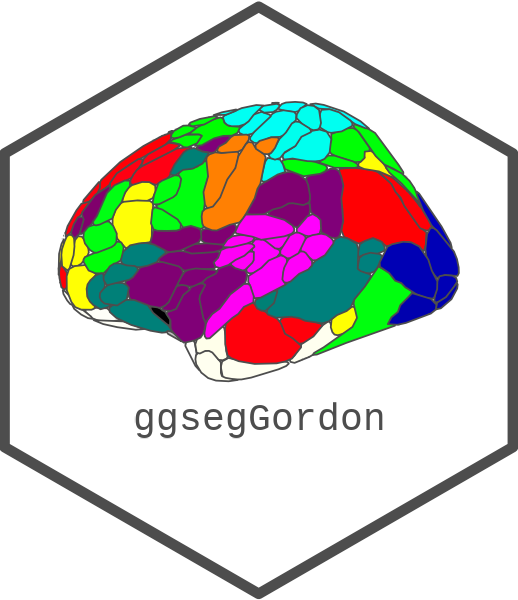
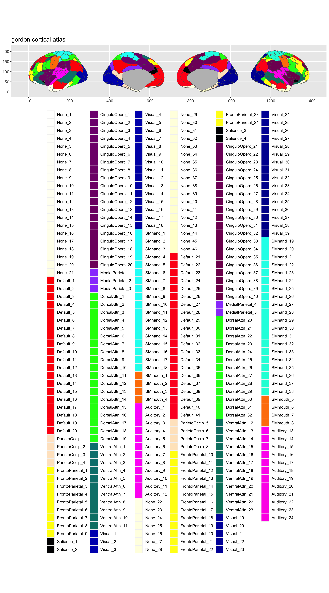
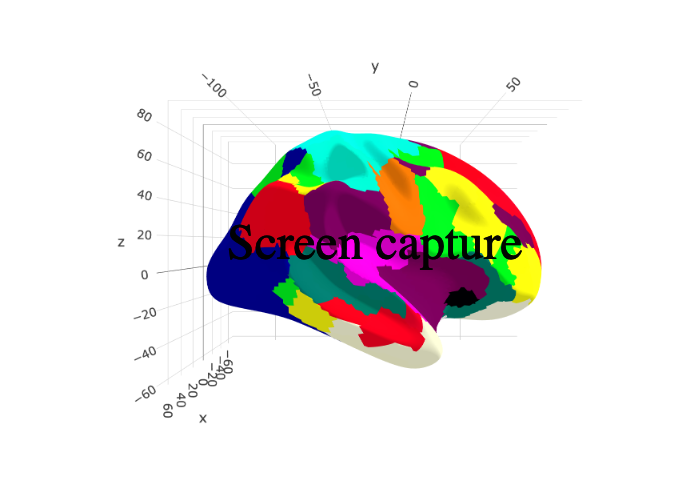

<!-- README.md is generated from README.Rmd. Please edit that file -->

# ggsegGordon 

<!-- badges: start -->

[](https://github.com/ggseg/ggsegGordon/actions)
<!-- badges: end -->

This package contains dataset for plotting the
[gordon](add%20url%20here) atlas ggseg and ggseg3d.

Gordon, E. M., Laumann, T. O., Adeyemo, B., Huckins, J. F., Kelley, W.
M., & Petersen, S. E. (2014). Generation and evaluation of a cortical
area parcellation from resting-state correlations. Cerebral cortex,
26(1), 288-303. Chicago
[PubMed](https://pubmed.ncbi.nlm.nih.gov/25316338/)

To learn how to use these atlases, please look at the documentation for
[ggseg](https://ggseg.github.io/ggseg/) and
[ggseg3d](https://ggseg.github.io/ggseg3d)

## Installation

We recommend installing the ggseg-atlases through the ggseg
[r-universe](https://ggseg.r-universe.dev/ui#builds):

``` r
# Enable this universe
options(repos = c(
    ggseg = 'https://ggseg.r-universe.dev',
    CRAN = 'https://cloud.r-project.org'))

# Install some packages
install.packages('ggsegGordon')
```

You can install the released version of ggsegGordon from
[GitHub](https://github.com/) with:

``` r
# install.packages("remotes")
remotes::install_github("ggseg/ggsegGordon")
```

``` r
library(ggseg)
#> Loading required package: ggplot2
library(ggseg3d)
library(ggsegGordon)

plot(gordon) +
  theme(legend.position = "bottom", 
        legend.text = element_text(size = 9)) +
  guides(fill = guide_legend(ncol = 6))
```



``` r
library(dplyr)
ggseg3d(atlas = gordon_3d) %>% 
  add_glassbrain() %>% 
  pan_camera("right lateral")
```



Please note that the ‘ggsegGordon’ project is released with a
[Contributor Code of Conduct](CODE_OF_CONDUCT.md). By contributing to
this project, you agree to abide by its terms.
